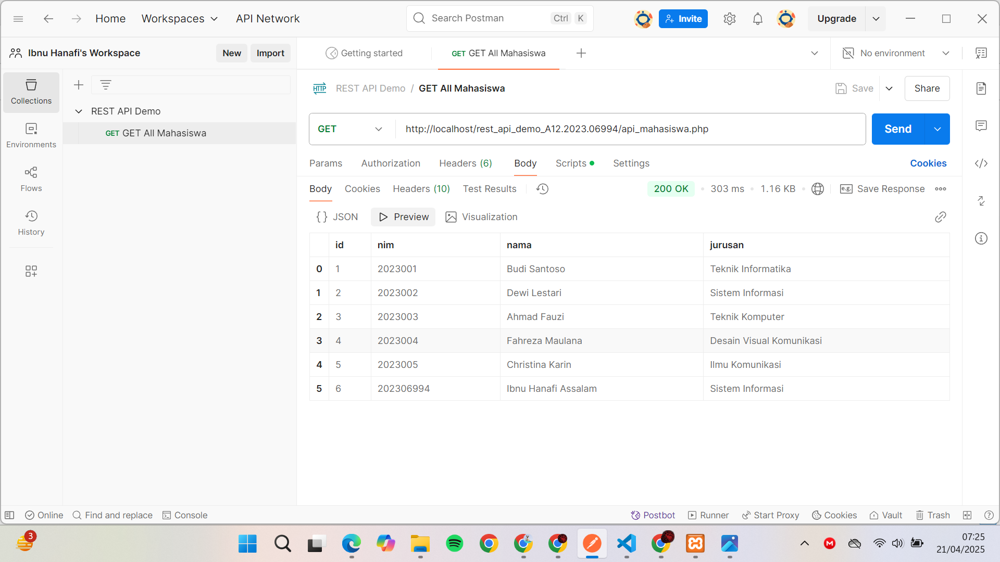
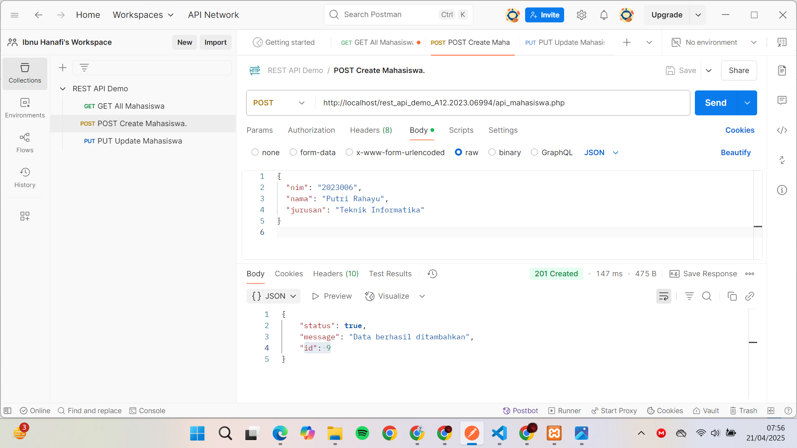
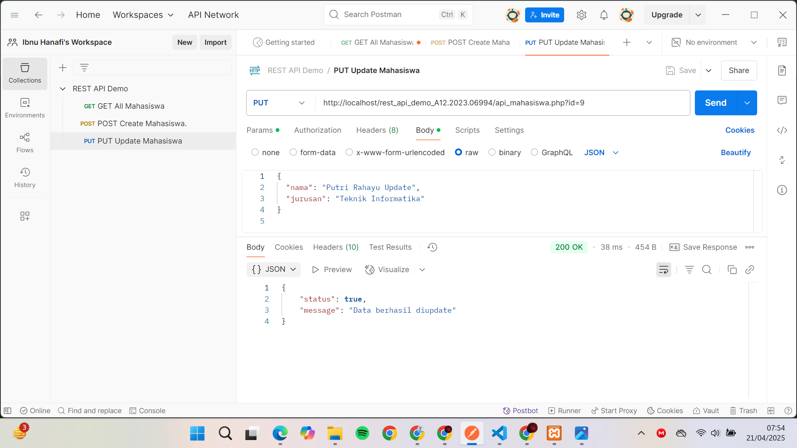
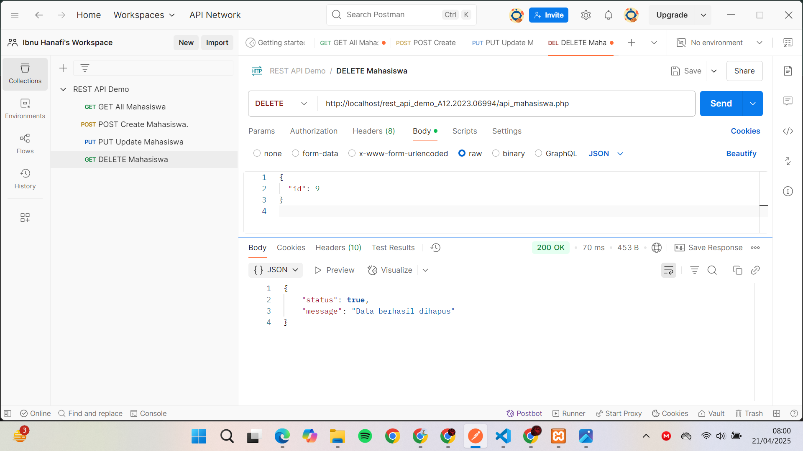
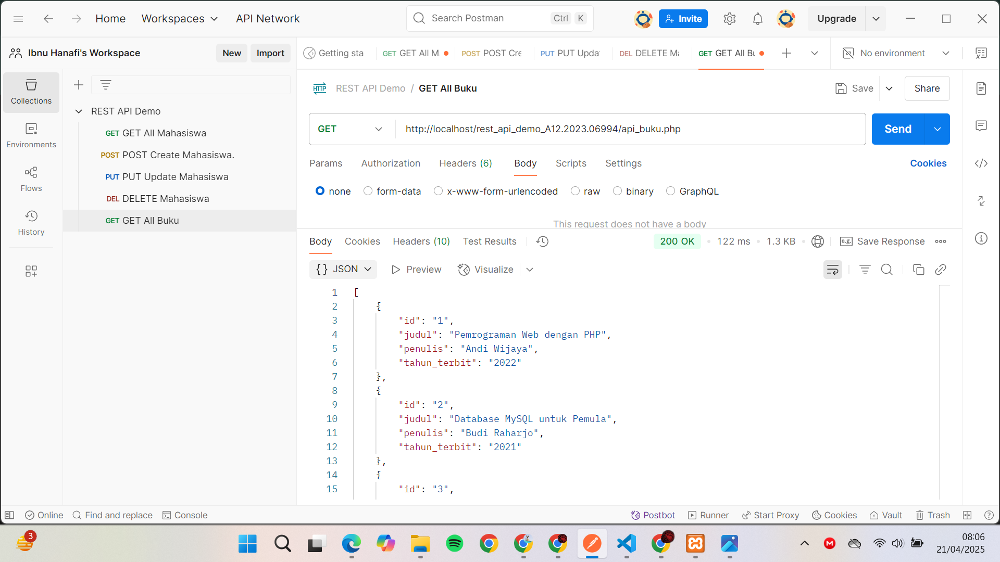
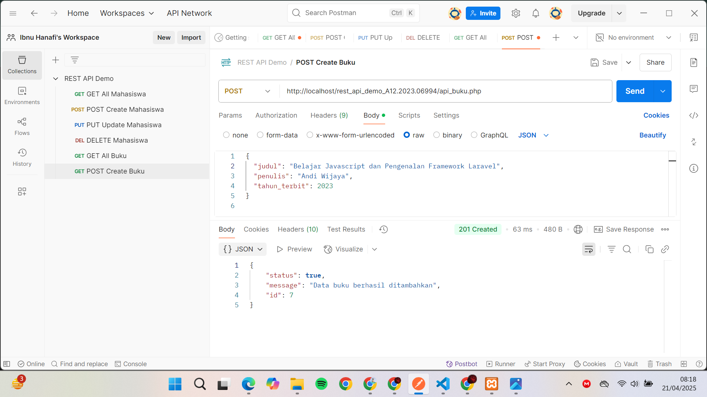
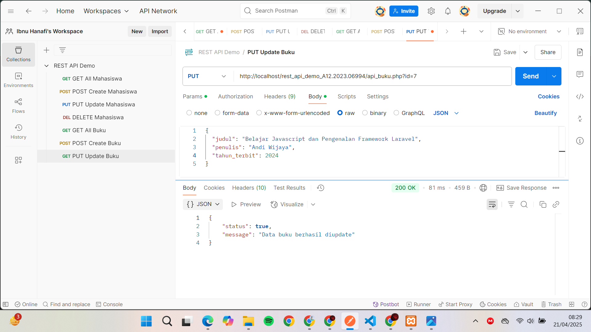
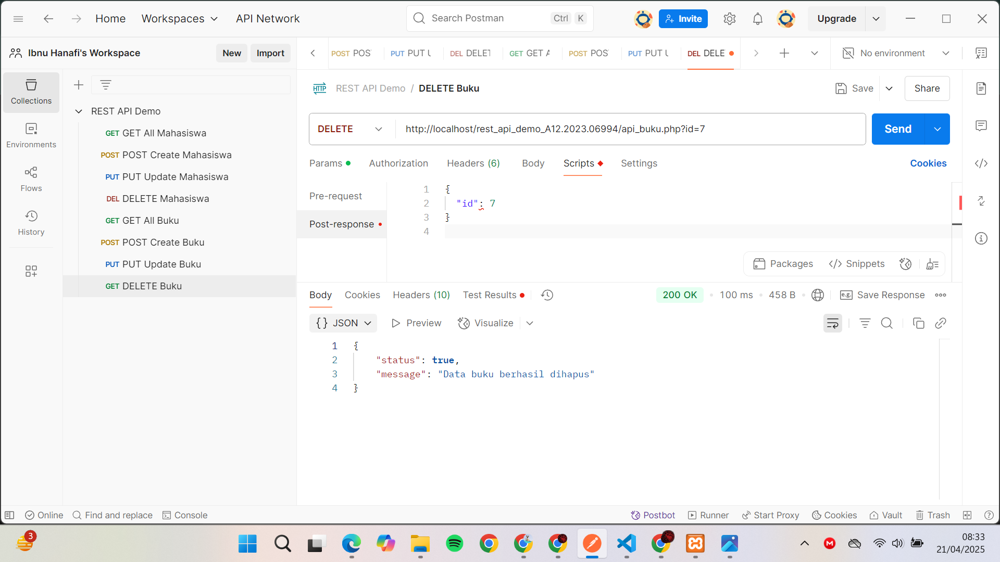

# REST API Demo

**Author**: Mutiara Acintyacitra Nirmala 
**NIM**: A12.2023.07059
**Kelompok**: PWL 6402
**Tanggal Pengumpulan**: Senin, 2 Juli 2025

## Deskripsi
Proyek ini adalah contoh sederhana implementasi REST API menggunakan PHP dan MySQL tanpa framework. Fitur yang disediakan:

- CRUD Mahasiswa (`api_mahasiswa.php`)
- CRUD Buku (`api_buku.php`)
- Mendukung metode HTTP: GET, POST, PUT, DELETE
- Response format JSON
- CORS headers untuk akses dari client-side

## Struktur Proyek
```
REST_API_DEMO_A12.2023.06994/
├── api_mahasiswa.php       # Endpoint CRUD mahasiswa
├── api_buku.php            # Endpoint CRUD buku
├── db.php                  # Koneksi dan konfigurasi database
├── database.sql            # Skrip SQL untuk tabel `mahasiswa` & `buku`
├── mahasiswa.html          # Contoh client HTML/JS untuk mahasiswa
├── buku.html               # Contoh client HTML/JS untuk buku
├── index1.html             # (opsional) halaman demo lain
├── .htaccess               # (opsional) rewrite rules Apache
├── README.md               # Dokumentasi proyek
├── js/                     # Folder skrip JavaScript (fetch API)
│   ├── script.js
│   └── buku.js
├── css/                    # Folder stylesheet
│   └── style.css
└── screenshoot/            # Folder screenshot Postman
    ├── GET_All_Mahasiswa.png
    ├── GET_All_Mahasiswa_Preview.png
    ├── POST_Create_Mahasiswa.png
    ├── PUT_Update_Mahasiswa.png
    ├── DELETE_Mahasiswa.png
    ├── GET_All_Buku.png
    ├── GET_All_Buku_Preview.png
    ├── POST_Create_Buku.png
    ├── PUT_Update_Buku.png
    └── DELETE_Buku.png


## Persiapan
1. Pastikan XAMPP/MAMP/LAMP sudah berjalan dan MySQL aktif.
2. Import `database.sql` ke server MySQL:
   ```sql
   CREATE DATABASE campus;
   USE campus;
   SOURCE database.sql;
   ```
3. Letakkan seluruh folder proyek di `htdocs` (atau `www`), misal: `htdocs/REST_API_DEMO_A12.2023.06994/`.

## Konfigurasi Database
Edit file `db.php` jika perlu, contoh default:
```php
$host = "localhost";
$user = "root";
$pass = "";
$db   = "campus";
```  
Tidak menggunakan eksternal dependency, jadi tidak perlu `.env` atau Composer.

## Mengakses API Base URL
Base URL (contoh): `http://localhost/rest_api_demo_A12.2023.06994/`

### Mahasiswa
| Method | URL                          | Keterangan                        |
|--------|------------------------------|-----------------------------------|
| GET    | `/api_mahasiswa.php`         | Ambil semua data mahasiswa        |
| POST   | `/api_mahasiswa.php`         | Tambah data baru (body JSON)      |
| PUT    | `/api_mahasiswa.php?id={id}` | Update data (body JSON)           |
| DELETE | `/api_mahasiswa.php?id={id}` | Hapus data mahasiswa berdasarkan id |

Contoh JSON POST/PUT:
```json
{
  "nim": "23007",
  "nama": "Nama Mahasiswa",
  "jurusan": "Teknik Informatika"
}
```

### Buku
| Method | URL                  | Keterangan                      |
|--------|----------------------|---------------------------------|
| GET    | `/api_buku.php`      | Ambil semua data buku           |
| POST   | `/api_buku.php`      | Tambah buku baru (body JSON)    |
| PUT    | `/api_buku.php?id=`  | Update buku (body JSON)         |
| DELETE | `/api_buku.php?id=`  | Hapus buku berdasarkan id       |

Contoh JSON POST/PUT:
```json
{
  "judul": "Judul Buku",
  "penulis": "Nama Penulis",
  "tahun_terbit": 2021
}
```

## Contoh Client
File `mahasiswa.html` dan `buku.html` sudah berisi contoh penggunaan Fetch API untuk interaksi CRUD via JavaScript.


# REST API Demo

## Daftar Endpoint

| Method | Endpoint               | Deskripsi                   |
| ------ | ---------------------- | --------------------------- |
| GET    | `/api_mahasiswa.php`   | Ambil semua data mahasiswa  |
| POST   | `/api_mahasiswa.php`   | Tambah data mahasiswa baru  |
| PUT    | `/api_mahasiswa.php`   | Update data mahasiswa       |
| DELETE | `/api_mahasiswa.php`   | Hapus data mahasiswa        |
| GET    | `/api_buku.php`        | Ambil semua data buku       |
| POST   | `/api_buku.php`        | Tambah data buku baru       |
| PUT    | `/api_buku.php`        | Update data buku            |
| DELETE | `/api_buku.php`        | Hapus data buku             |

---

## Berkut adalaha lampiran :
## Contoh Hasil di Postman :

### GET All Mahasiswa  



### POST Create Mahasiswa  


### PUT Update Mahasiswa  


### DELETE Mahasiswa  


---

### GET All Buku  



### POST Create Buku  


### PUT Update Buku  


### DELETE Buku  


---

## Testing  
Gunakan Postman atau cURL.  
Pastikan header:  


## Testing
Gunakan Postman atau cURL. Pastikan header:
```
Content-Type: application/json
```
Saat mengirim POST, PUT, DELETE body JSON.

## Kesimpulan

- **Apa yang dipelajari?**  
  Saya mempelajari cara membuat REST API sederhana dengan PHP, termasuk menangani request GET, POST, PUT, dan DELETE, serta mengembalikan response dalam format JSON.

- **Apa kesulitan yang dihadapi?**  
  Tantangan terbesar adalah memahami alur CORS, parsing body JSON untuk PUT/DELETE, dan memastikan header HTTP sudah benar agar client (fetch/Postman) dapat berkomunikasi lancar dengan server.

- **Bagaimana REST API bisa digunakan dalam aplikasi nyata?**  
  REST API ini bisa menjadi backend untuk front‑end JavaScript (misalnya React/Vue) atau aplikasi mobile, memungkinkan aplikasi klien mengambil, menambah, mengubah, dan menghapus data tanpa perlu reload halaman, serta mempermudah integrasi antar sistem.


## Lisensi
Proyek ini bersifat contoh tugas praktikum. Bebas digunakan untuk pembelajaran. Sekian dan Terimakasih, Semoga Bermanfaat.